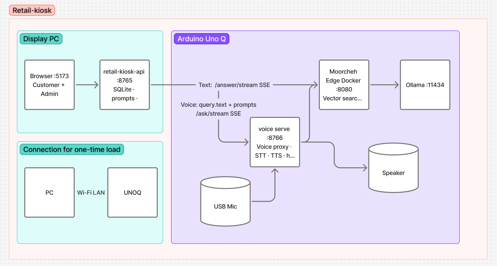

# Retail Kiosk

In-store kiosk demo for a neighborhood shop like **The Brew Corner** — a café and mini-market. Shoppers ask about products, prices, and store policies by **text or voice**; answers stream on the display and can play on the Arduino UNO Q speaker.

**Admin** and **Customer** live in the same web app for this demo (`/admin` and `/`). In production you would usually run them on separate screens.

**Powered by [Moorcheh](https://moorcheh.ai)** — vector search, streaming RAG, and the local LLM all run on the edge via [moorcheh-edge](https://github.com/moorcheh-ai/moorcheh-edge).

---

## Get started

See **[QUICKSTART.md](QUICKSTART.md)** for prerequisites, configuration, install steps, catalog upload, tests, and troubleshooting.

---

## How it works

Two machines work together: a **display PC** runs the kiosk UI and API; an **Arduino UNO Q** runs Moorcheh Edge, Ollama, and voice.

| Machine | Responsibility |
|---------|----------------|
| **Display PC** | React UI (`:5173`), `retail-kiosk-api` (`:8765`), SQLite for chat history and prompts |
| **Arduino UNO Q** | Moorcheh Edge (`:8080`), Ollama (`:11434`), voice server (`:8766`), USB mic and speaker |

All AI for search and answers runs on the **UNO Q**. The PC is the kiosk display and API gateway: it stores chat history and prompts locally, then forwards customer questions to the board over Wi‑Fi.

**Demo catalog:** load documents on the UNO Q with `tests/upload-catalog-to-edge.py`. Use **Admin → Prompts** on the PC to customize header/footer text (defaults are included for The Brew Corner).

### Request flow

**Text question**

1. Browser (Customer) → `retail-kiosk-api` on the PC (`:8765`)
2. PC API → Moorcheh Edge on the UNO Q (`:8080`, `/answer/stream` SSE)
3. Moorcheh Edge → vector search → Ollama (`:11434`) → streamed answer back to the UI

**Voice question**

1. Browser → PC API → voice server on the UNO Q (`:8766`, `/ask/stream` SSE)
2. USB mic → speech-to-text → query text + prompts sent to Moorcheh Edge (`:8080`)
3. Answer streams to the screen; text-to-speech plays on the UNO Q speaker

**Load catalog (one-time setup)**

1. Copy catalog JSON and upload script from the PC to the UNO Q over Wi‑Fi (SCP)
2. Script embeds chunks on the board and uploads them to Moorcheh Edge (`:8080`)

---

## Ports (summary)

| Port | Machine | Service |
|------|---------|---------|
| **5173** | PC | React UI |
| **8765** | PC | `retail-kiosk-api` |
| **8766** | UNO Q | `moorcheh-edge voice serve` |
| **8080** | UNO Q | Moorcheh Edge (Docker) |
| **11434** | UNO Q | Ollama |

Full port and environment-variable details are in [QUICKSTART.md](QUICKSTART.md).
